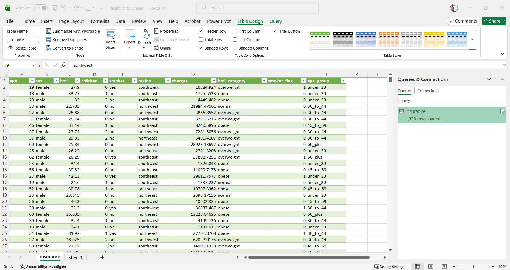
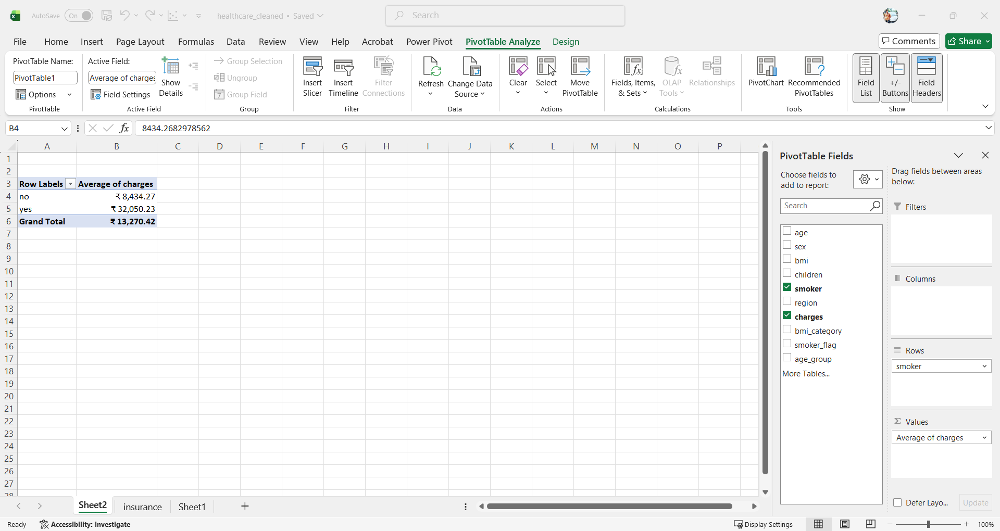
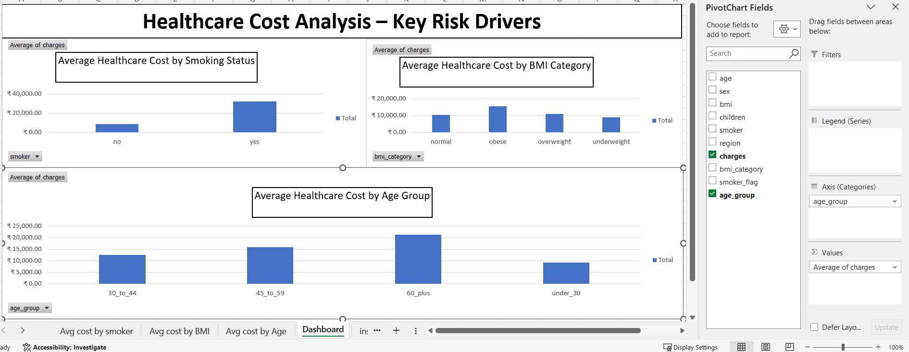

# Excel Analysis Screenshots

This section shows key Excel-based analysis steps used to identify healthcare cost drivers.

## Power Query – Data Cleaning & Transformation

## Pivot Table – Average Cost Analysis

## Final Excel Dashboard

