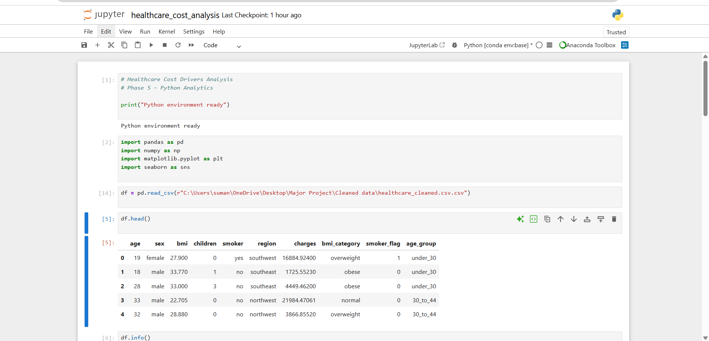
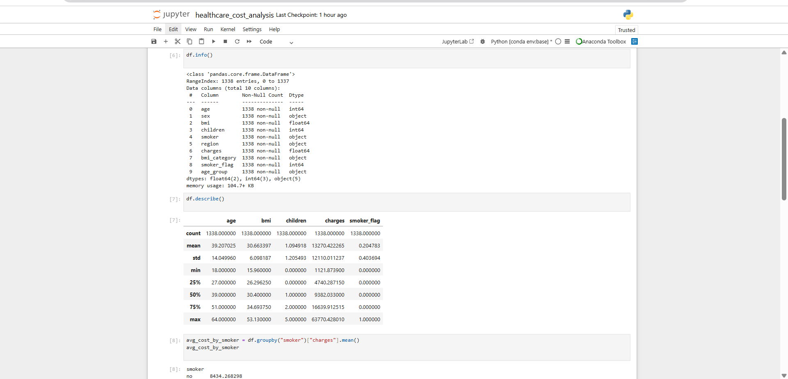
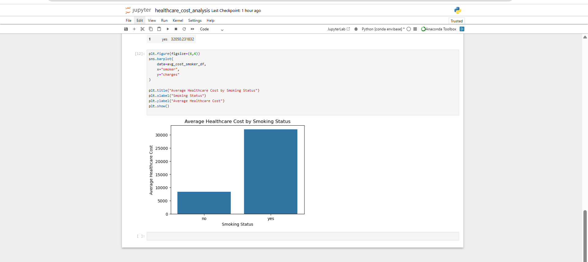

# Python Analysis Screenshots

This section presents screenshots from the Python-based analysis performed to validate healthcare cost drivers using pandas and matplotlib.

---

## Data Loading Verification

Confirms successful loading of the healthcare dataset into the Python environment.

---

## Data Structure & Summary Statistics

Displays dataset structure and descriptive statistics to understand distributions and data quality.

---

## Average Cost Calculations

Shows Python-based aggregation logic used to compute average healthcare costs across categories.

---

## Visual Analysis

Visualizes healthcare cost patterns to support insights identified across tools.

---

## Summary

These Python results were used to:
- Validate calculations performed in Excel and SQL
- Support visual findings in Tableau
- Ensure consistency of healthcare cost insights across tools
