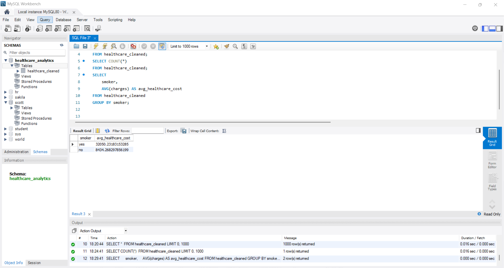

# SQL Analysis Screenshots

This section presents SQL query execution screenshots used to validate healthcare cost drivers.

## Row Count Validation

## Average Cost by Smoker Status

## Average Cost by Age Group

