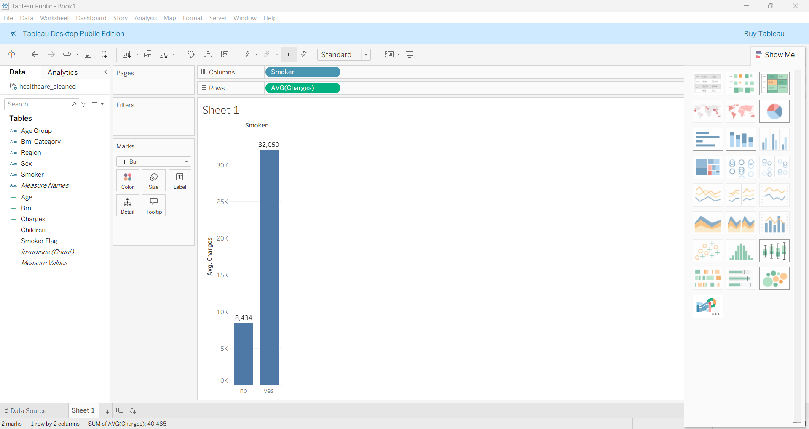

# Tableau Analysis Screenshots

This folder contains Tableau visualizations created to analyze healthcare cost drivers.

---

## Average Cost by Age Group

Shows how average healthcare cost varies across age groups.

---

## Average Cost by BMI Category

Shows how healthcare costs differ by BMI category.

---

## Average Cost by Smoker Status

Compares healthcare costs between smokers and non-smokers.

---

## Final Dashboard

Consolidated Tableau dashboard summarizing all key healthcare cost drivers.

---

## Summary

These Tableau visuals were used to:

- Identify key healthcare cost drivers  
- Compare demographic and behavioral segments  
- Validate findings from Excel, SQL, and Python  
- Present insights in a business-friendly dashboard
